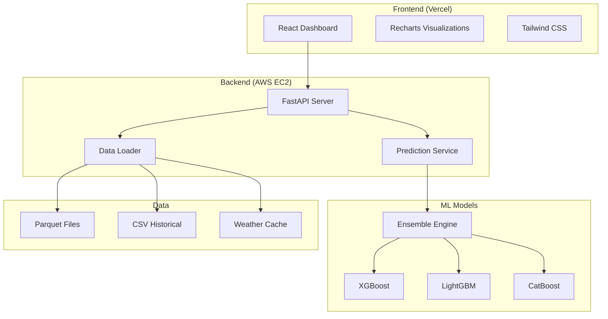

# NYC Citi Bike Analytics Dashboard 🚴

A production-grade, full-stack analytics dashboard for NYC Citi Bike demand prediction and visualization, featuring a 3-model ML ensemble achieving **R² = 0.781**.


## 🌐 Live Demo

| Component | URL |
|-----------|-----|
| **Dashboard** | [citibike-capstone-project.vercel.app](https://citibike-capstone-project.vercel.app) |
| **API** | [18.218.154.66.nip.io/api](https://18.218.154.66.nip.io/api) |

## 📚 Documentation

| Document | Description |
|----------|-------------|
| [API Documentation](docs/API.md) | All 17 API endpoints |
| [Architecture](docs/ARCHITECTURE.md) | System design and diagrams |
| [Data Dictionary](docs/DATA_DICTIONARY.md) | Data sources and 54 features |
| [Methodology](docs/METHODOLOGY.md) | ML approach and results |
| [Model Evaluation](docs/MODEL_EVALUATION.md) | Performance metrics |
| [Requirements](docs/REQUIREMENTS.md) | Functional requirements |

## 🏗️ Architecture



## 🚀 Quick Start

### Prerequisites
- Python 3.11+
- Node.js 18+
- npm or yarn

### Backend Setup
```bash
cd backend
python -m venv venv
source venv/bin/activate  # Windows: venv\Scripts\activate
pip install -r requirements.txt
uvicorn main:app --reload
```

### Frontend Setup
```bash
cd frontend
npm install
npm run dev
```

## 📊 Features

| Feature | Description |
|---------|-------------|
| **Neural Demand Predictions** | ML ensemble predicting 48-hour bike demand |
| **Interactive Maps** | Station locations with demand heatmaps |
| **Route Analysis** | Top routes and flow patterns |
| **Advanced Analytics** | ABM simulation, TFT forecasting, equity analysis |
| **Real-time Dashboard** | Weather integration and live updates |

## 🔌 API Endpoints

| Endpoint | Method | Description |
|----------|--------|-------------|
| `/api/system-overview` | GET | Dashboard KPIs and time series |
| `/api/stations` | GET | List all stations |
| `/api/map-data` | GET | Station coordinates |
| `/api/routes` | GET | Top route flows |
| `/api/station/{name}` | GET | Station details |
| `/api/predict` | POST | Generate predictions |
| `/api/historical-demand` | GET | Historical demand data |
| `/api/advanced-analytics/*` | GET | Advanced features |

## 🤖 ML Models

| Model | R² Score | MAE | File Size |
|-------|----------|-----|-----------|
| XGBoost | 0.78 | 2.66 | 59 MB |
| LightGBM | 0.78 | 2.64 | 11 MB |
| CatBoost | 0.78 | 2.68 | 2.4 MB |
| **Ensemble** | **0.781** | **2.66** | - |

## 🧪 Testing

```bash
# Backend tests
cd backend
python -m pytest -v

# Smoke test
python test_smoke.py
```

## 📁 Project Structure

```
├── backend/
│   ├── main.py              # FastAPI application
│   ├── prediction_service.py # ML prediction engine
│   ├── data_loader.py       # Data loading utilities
│   ├── models/              # Trained ML models
│   └── data/                # Data files
├── frontend/
│   ├── src/
│   │   ├── pages/           # React page components
│   │   ├── components/      # Reusable components
│   │   └── api.js           # API client
│   └── public/
├── .github/workflows/       # CI/CD configuration
└── .pre-commit-config.yaml # Code quality hooks
```

## 🔧 Configuration

Copy `.env.example` to `.env` and configure:

```env
VITE_API_URL=http://localhost:8000/api
```

## 🚀 Deployment

### AWS EC2
```bash
ssh -i citibike-key.pem ubuntu@18.218.154.66
cd CITIBIKE-CAPSTONE-PROJECT
git pull
sudo systemctl restart citibike
```

### Vercel (Frontend)
Automatic deployment on push to main branch.

## 📄 License

MIT License - see LICENSE for details.

## 👥 Contributors

- Ashish B - Lead Developer
- Venkata Krishna Ullam


## Notion DashBoard
  https://www.notion.so/NYC-City-Bike-Info-27ff707809b380aa9bf6eb521b19832d
